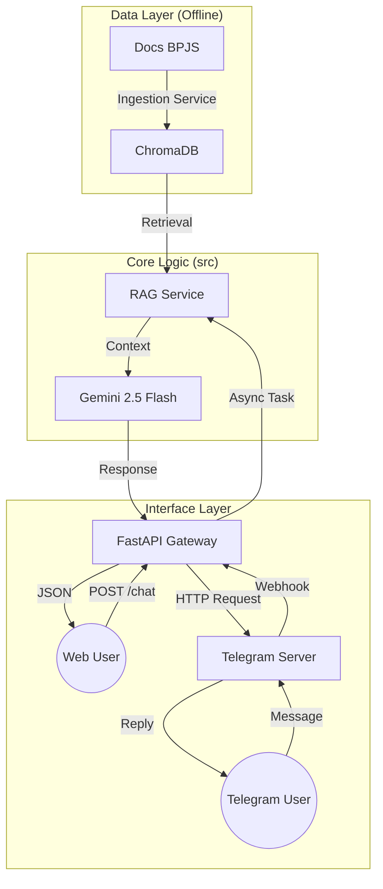

# 🏥 BPJS RAG Intelligence System (Omnichannel Support)


## 📋 Executive Summary

**BPJS RAG Intelligence System** adalah solusi *Enterprise AI* yang dirancang untuk mengotomatisasi layanan informasi BPJS Kesehatan. Sistem ini tidak hanya menjawab pertanyaan melalui Web Chat, tetapi juga terintegrasi penuh dengan **Telegram Bot** untuk aksesibilitas mobile yang lebih luas.

Menggunakan arsitektur **Retrieval-Augmented Generation (RAG)**, sistem ini meminimalkan halusinasi AI dengan mengambil rujukan langsung dari dokumen regulasi BPJS resmi (PDF). Backend dibangun dengan **FastAPI** yang menangani *concurrency* tinggi menggunakan *Asynchronous Background Tasks*.

---

## 🏗 System Architecture

Sistem beroperasi dengan pendekatan *Event-Driven* untuk Telegram dan *RESTful* untuk Web:



### Key Technical Features:

1. **Omnichannel Interface:** Satu backend melayani dua frontend sekaligus (Web & Telegram).
2. **Async Webhook Handling:** Menggunakan `BackgroundTasks` FastAPI untuk memproses pesan Telegram di latar belakang, mencegah *timeout* pada server Telegram.
3. **Modular Architecture:** Pemisahan tegas antara `Core Logic` (src), `Data`, dan `Frontend`.

---

## 📂 Project Structure

```bash
BPJS-RAG-Chatbot/
├── config/             # System Prompts & Personas
├── data/               # Persistent Data Layer
│   ├── raw_docs/       # [INPUT] Repository PDF BPJS
│   └── vector_store/   # [OUTPUT] Vector Embeddings (ChromaDB)
├── src/                # Core Business Logic
│   ├── core/           # Config, Logger, Security
│   ├── domain/         # Pydantic Schemas (Data Validation)
│   └── services/       # AI Services (Ingestion, Chat, RAG)
├── web front-end/      # Interface Web (HTML/JS/FastAPI)
├── telegram front-end/ # Interface Telegram (Webhook Handler)
├── environment.yml     # Project Dependencies
└── README.md           # Documentation

```

---

## ⚡ Installation & Setup Guide

### 1. Prerequisites

* Python 3.10+
* Google AI Studio API Key
* Telegram Bot Token (dari @BotFather)

### 2. Environment Configuration

Buat file `.env` di root folder. **PENTING:** Jangan hardcode token di script!

```env
# AI Credentials
GOOGLE_API_KEY=masukkan_api_key_google_disini

# Telegram Credentials
TELEGRAM_BOT_TOKEN=masukkan_token_bot_telegram_disini

# System Config
GENAI_MODEL=models/gemini-2.5-flash
EMBEDDING_MODEL=models/gemini-embedding-001
CHROMA_PATH=data/vector_store

```

### 3. Install Dependencies

```bash
# Menggunakan PIP (Wajib install httpx untuk Telegram)
pip install fastapi uvicorn[standard] httpx langchain langchain-google-genai langchain-chroma chromadb pydantic-settings python-multipart pyyaml tqdm

```

---

## 🚀 How to Run

### Phase 1: Data Ingestion (Wajib Awal)

Proses dokumen PDF menjadi Vector Database.

```bash
python -m src.services.ingestion_service

```

*Pastikan folder `data/raw_docs` sudah berisi file PDF.*

### Phase 2: Running the Interface

**Option A: Web Interface**
Untuk menjalankan mode Web Chat sederhana:

```bash
cd "web front-end"
uvicorn main:app --reload --port 8000

```

Akses di: `http://localhost:8000`

**Option B: Telegram Interface (Webhook Mode)**
Untuk mengaktifkan bot Telegram, Anda memerlukan URL publik (gunakan `ngrok` untuk lokal).

1. Jalankan Server:
```bash
cd "telegram front-end"
uvicorn main:app --reload --port 8000

```


2. Expose ke Public (Terminal baru):
```bash
ngrok http 8000

```


3. Set Webhook (Hanya sekali):
Buka browser dan akses URL ini:
`https://api.telegram.org/bot<YOUR_TOKEN>/setWebhook?url=<NGROK_URL>/webhook/telegram`

---

## 🧪 Testing

* **Web:** Buka `http://localhost:8000/docs` dan test endpoint `/chat`.
* **Telegram:** Kirim pesan ke bot Anda di aplikasi Telegram. Bot akan merespons dengan indikator *typing...* dan memberikan jawaban berbasis data.

---

## 👤 Author

**Ach. Jazilul Qutbi**
*Robotics & AI Engineer*

> *"Bridging complex AI research with scalable industry applications."*

```
